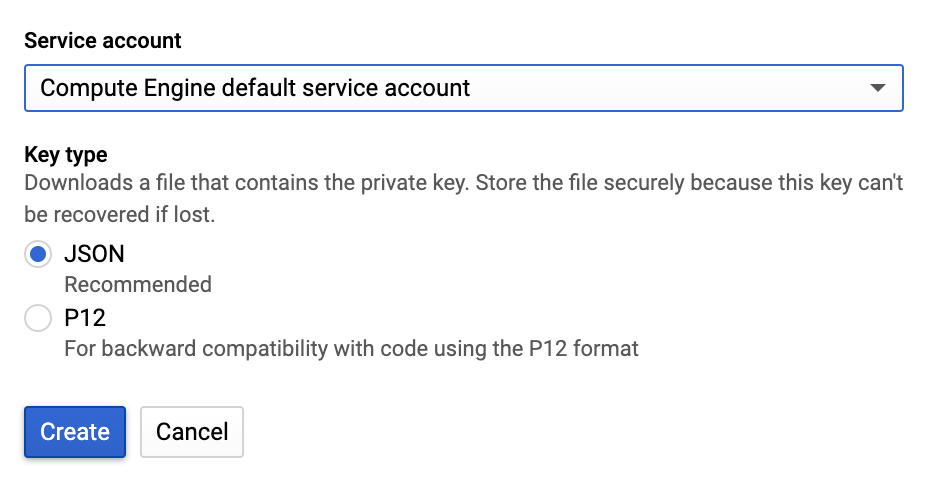
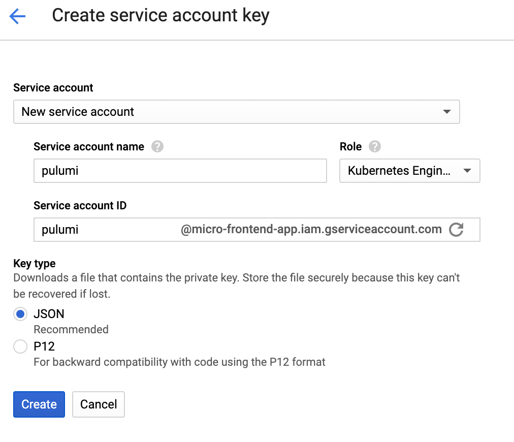
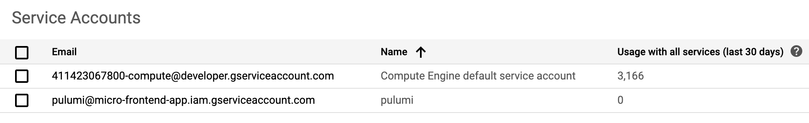

# Pulumi stack for importmap deployer on GCP

This Pulumi stack is designed to make it easy to set up GCP infrastructure for [importmap-deployer](https://github.com/single-spa/import-map-deployer)

The stack will:

- Create a Storage Bucket
- Create a Kubernetes cluster or Cloud Run configuration

## Install

Install dependencies

```sh
$ npm i
# dependencies
```

## Run

```sh
$ pulumi up

Previewing update (dev):

     Type                   Name                    Plan       Info
 +   pulumi:pulumi:Stack    importmap-deployer-dev  create
     └─ gcp:storage:Bucket  my-bucket
```

## Troubleshoot

`google: could not find default credentials`. See [application-default-credentials](https://developers.google.com/accounts/docs/application-default-credentials) for more information.

### From GCP console

[credentials serviceaccountkey](https://console.cloud.google.com/apis/credentials/serviceaccountkey)

Default service account



Service account



Service accounts



### using gcloud

Create the service account. Replace [NAME] with a name for the service account.

`gcloud iam service-accounts create [NAME]`

Grant permissions to the service account. Replace [PROJECT_ID] with your project ID.

`gcloud projects add-iam-policy-binding [PROJECT_ID] --member "serviceAccount:[NAME]@[PROJECT_ID].iam.gserviceaccount.com" --role "roles/owner"`

Generate the key file. Replace [FILE_NAME] with a name for the key file.

`gcloud iam service-accounts keys create [FILE_NAME].json --iam-account [NAME]@[PROJECT_ID].iam.gserviceaccount.com`

Provide authentication credentials to your application code by setting the environment variable GOOGLE_APPLICATION_CREDENTIALS. Replace [PATH] with the file path of the JSON file that contains your service account key, and [FILE_NAME] with the filename. 

`export GOOGLE_APPLICATION_CREDENTIALS="[PATH]"`

For example:

`export GOOGLE_APPLICATION_CREDENTIALS="/home/user/Downloads/[FILE_NAME].json"`